# askai-python 🚀

<p align="center">
  🌍 <b>Readme:</b>
  <a href="../README.md"> English</a> · 
  <a href="README_fa.md"> فارسی</a> · 
  <a href="README_zh.md"> 中文</a> · 
  <a href="README_tr.md"> Türkçe</a> · 
  <a href="README_ar.md"> العربية</a> · 
  <a href="README_ru.md"> Русский</a> · 
  <a href="README_es.md"> Español</a> · 
  <a href="README_ja.md"> 日本語</a>
</p>


<p align="center">
  
</p>

<p align="center">
  <b>یک SDK مینیمال پایتون برای جابجایی بین سرویس‌های هوش مصنوعی فقط با یک خط کد.</b><br/>
  بدون فریم‌ورک اضافه. بدون نیاز به سرور. بدون پیچیدگی.
</p>

[](https://pypi.org/project/askai-python/)
[](https://opensource.org/licenses/MIT)
[](https://www.python.org/downloads/)

---

## ⚡ شروع سریع (در ۵ ثانیه)

```bash
pip install askai-python
```

```python
from ask_ai import OpenAI, Groq

# کلید OPENAI_API_KEY را به طور خودکار از محیط می‌خواند
OpenAI().ask("سیاه‌چاله‌ها را مثل یک کودک ۵ ساله توضیح بده").text

# تغییر سرویس‌دهنده به صورت آنی
Groq().ask("سیاه‌چاله‌ها را مثل یک کودک ۵ ساله توضیح بده").text
```

---

## 🧐 چرا askai-python؟

- **یک تابع ساده**: فقط کافیست `.ask()` را صدا بزنید.
- **سرویس‌های متعدد**: پشتیبانی از OpenAI, Anthropic, Google Gemini, Groq, Azure, OpenRouter.
- **بدون پیکربندی (Zero Config)**: کلیدهای API مستقیماً از متغیرهای سیستم عامل خوانده می‌شوند.
- **یک SDK، نه یک فریم‌ورک**: در معماری و کد شما دخالت نمی‌کند.

## 🚫 این پروژه چه چیزی نیست؟

> ❌ یک فریم‌ورک بزرگ هوش مصنوعی نیست.
> ❌ یک API Gateway نیست.
> ❌ یک سیستم حافظه Agent نیست.

این پروژه فقط یک کار را به بهترین نحو انجام می‌دهد: **ساده‌سازی تماس API با LLMها.**

---

## 🛠️ استفاده پیشرفته

### 🧰 ابزارهای توسعه‌دهنده (Auto-Parsing)

<p align="center">
  
</p>
دیگر نیازی به نوشتن عبارت‌های باقاعده (Regex) برای تمیز کردن خروجی مدل‌ها ندارید! `askai-python` پرچم‌های تمیزکاری داخلی دارد:

```python
from ask_ai import OpenAI
ai = OpenAI()

# 1. Clean Markdown (حذف بک‌تیک‌های ```json و ...)
clean_text = ai.ask("Write JSON", clean=True).text

# 2. Extract Code (استخراج و برگرداندن فقط بلاک کد پایتون/غیره بدون حرف اضافه)
code = ai.ask("Write a python ping script", code=True).text

# 3. Strip Tags (حذف تگ‌های <think> مدل DeepSeek و تگ‌های HTML)
answer_only = ai.ask("What is 1+1?", strip=True).text

# 4. Enforce & Parse JSON (برگرداندن مستقیم خروجی مدل به فرمت دکشنری پایتون)
data_dict = ai.ask("Extract user info", json=True).json
print(data_dict['name'])
```

### 🔄 مقاومت داخلی (Retries & Timeout)

<p align="center">
  
</p>
مدیریت هوشمند خطاهای اینترنت و محدودیت‌های سرعت (`429`) با تکنیک تاخیر تصاعدی (Exponential Backoff):

```python
from ask_ai import OpenAI
ai = OpenAI()

# در صورت بروز خطای شبکه تا ۳ بار تلاش مجدد می‌کند (با تایم‌اوت ۱۰ ثانیه)
response = ai.ask("یک اسکریپت پایتون بنویس", retry=3, timeout=10)
```

### ⚙ پیکربندی سیستم 
تنظیم نقش سیستم و درجه حرارت به صورت مستقیم:

```python
ai.advanced(
    temperature=0.7,
    prompt="You are a senior DevOps engineer."
)

print(ai.ask("How do I optimize a Dockerfile?").text)
```

---

### 🎨 تولید رسانه (عکس و صوت)

تولید تصویر یا تبدیل متن به گفتار با سرویس‌دهنده‌های سازگار:

```python
from ask_ai import OpenAI

ai = OpenAI()

# تولید عکس با استفاده از DALL-E
img_response = ai.ask("A majestic lion in a neon city", output_type="image")
img_response.save("lion.png")

# تبدیل متن به گفتار
audio_response = ai.ask("Hello, this is a voice.", output_type="audio")
audio_response.save("welcome.mp3")
```

---

### 🔗 زنجیره‌سازی سرویس‌های جایگزین (Fallback)

جلوگیری از قطع شدن برنامه با تعریف سرویس‌دهنده‌های جایگزین:

```python
from ask_ai import OpenAI, Groq

ai = OpenAI()

# در صورت عدم کارکرد یا محدودیت سرعت OpenAI، به طور خودکار به Groq منتقل می‌شود
response = ai.ask("Explain quantum physics", providers=[ai, Groq])
print(response.text)
```

---

### 📋 خروجی ساختاریافته (پشتیبانی از Pydantic)

مجبور کردن مدل به پاسخ‌دهی کاملاً منطبق بر ساختار Pydantic:

```python
from pydantic import BaseModel
from ask_ai import OpenAI

class User(BaseModel):
    name: str
    age: int

ai = OpenAI()
response = ai.ask("Extract name: Alice is 30.", response_model=User)

user = response.pydantic
print(user.name)  # "Alice"
print(user.age)   # 30
```

---

## 🗺️ نقشه راه (Roadmap)

### 🚀 نقشه راه 2.0 (فعال)
- [x] زنجیره‌سازی آدرس‌های جایگزین (Fallback) و خروجی ساختاریافته Pydantic
- [ ] دریافت ورودی چندرسانه‌ای (تصویر به متن) برای همه سرویس‌دهنده‌های اصلی
- [ ] پشتیبانی بومی از ابزارها و اجرای توابع (Function Calling)
- [ ] مدیریت تاریخچه گفتگو و حافظه نشست‌ها

### 🏁 نقشه راه 1.0 (تکمیل شده)
- ~~[x] پشتیبانی از سرویس‌دهنده‌های برتر~~
- ~~[x] تبدیل متن به عکس و صوت~~
- ~~[x] کنترل‌کننده‌های داخلی سعی مجدد و Timeout~~
- ~~[x] ابزارهای استخراج خودکار کد و جیسون (Developer QoL)~~
- ~~[x] توابع حالت غیرهمزمان (`await ask_async`)~~
- ~~[x] لیست سرویس‌های جایگزین (`ask(..., providers=[OpenAI, Groq])`)~~

---

## 🔗 لینک‌های مهم

- **مخزن گیت‌هاب**: [Hosseinghorbani0/askai-python](https://github.com/Hosseinghorbani0/askai-python) (ستاره فراموش نشود! ⭐)
- **پکیج PyPI**: [askai-python](https://pypi.org/project/askai-python/)
- **وب‌سایت رسمی**: [hosseinghorbani0.ir](https://hosseinghorbani0.ir/)
