# askai-python 🚀

<p align="center">
  🌍 <b>Readme:</b>
  <a href="../README.md"> English</a> · 
  <a href="README_fa.md"> فارسی</a> · 
  <a href="README_zh.md"> 中文</a> · 
  <a href="README_tr.md"> Türkçe</a> · 
  <a href="README_ar.md"> العربية</a> · 
  <a href="README_ru.md"> Русский</a> · 
  <a href="README_es.md"> Español</a> · 
  <a href="README_ja.md"> 日本語</a>
</p>


<p align="center">
  
</p>

<p align="center">
  <b>一个极简的 Python SDK，用一行代码在不同的 LLM 供应商之间切换。</b><br/>
  没有框架。没有服务器。没有过度设计。
</p>

[](https://pypi.org/project/askai-python/)
[](https://opensource.org/licenses/MIT)
[](https://www.python.org/downloads/)

---

## ⚡ 快速开始 (5 秒)

```bash
pip install askai-python
```

```python
from ask_ai import OpenAI, Groq

# 自动从环境变量检测 OPENAI_API_KEY
OpenAI().ask("像给5岁孩子一样解释黑洞").text

# 毫不费力地切换供应商
Groq().ask("像给5岁孩子一样解释黑洞").text
```

---

## 🧐 为什么选择 ask-ai？

- **一个函数**: 只需调用 `.ask()`
- **多个供应商**: OpenAI, Anthropic, Google Gemini, Groq, Azure, OpenRouter
- **零配置**: 自动从环境中提取密钥
- **SDK 优先，而不是框架**: 它绝不会妨碍您。

## 🚫 这个项目不是什么

> ❌ 不是一个人工智能框架
> ❌ 不是一个 API 网关
> ❌ 不是一个代理内存系统

它只完美地做一件事：**简化对 LLM 的 API 调用。**

---

## 🛠️ 高级用法

### 🧰 开发者实用工具 (Auto-Parsing)

<p align="center">
  
</p>
内置文本处理工具，告别手写 Regex！

```python
from ask_ai import OpenAI
ai = OpenAI()

# 1. Clean Markdown (删除 ```json 等标签)
clean_text = ai.ask("Write JSON", clean=True).text

# 2. Extract Code (仅返回代码块，忽略对话废话)
code = ai.ask("Write a python script", code=True).text

# 3. Strip Tags (删除 <think> 和 HTML 标签)
answer_only = ai.ask("What is 1+1?", strip=True).text

# 4. Enforce & Parse JSON (直接返回解析后的 Python 字典)
data_dict = ai.ask("Extract info", json=True).json
print(data_dict['name'])
```

### 🔄 内置重试和超时 (弹性)

<p align="center">
  
</p>
自动处理速率限制 (`429`) 和网络中断：

```python
# 在遇到网络错误时重试最多 3 次，设置一般超时时间为 10 秒
response = ai.ask("编写一个 Python 脚本", retry=3, timeout=10)
```

### ⚙ 系统配置
直接设置系统提示词(System prompts)和温度(Temperature)：

```python
ai.advanced(
    temperature=0.7,
    prompt="你是一名高级 DevOps 工程师。"
)

print(ai.ask("我该如何优化 Dockerfile？").text)
```

---

## 🔗 重要链接

- **GitHub 仓库**: [Hosseinghorbani0/ask-ai](https://github.com/Hosseinghorbani0/ask-ai) (请给我们点亮星星 ⭐)
- **PyPI**: [askai-python](https://pypi.org/project/askai-python/)
- **官方网站**: [hosseinghorbani0.ir](https://hosseinghorbani0.ir/)
